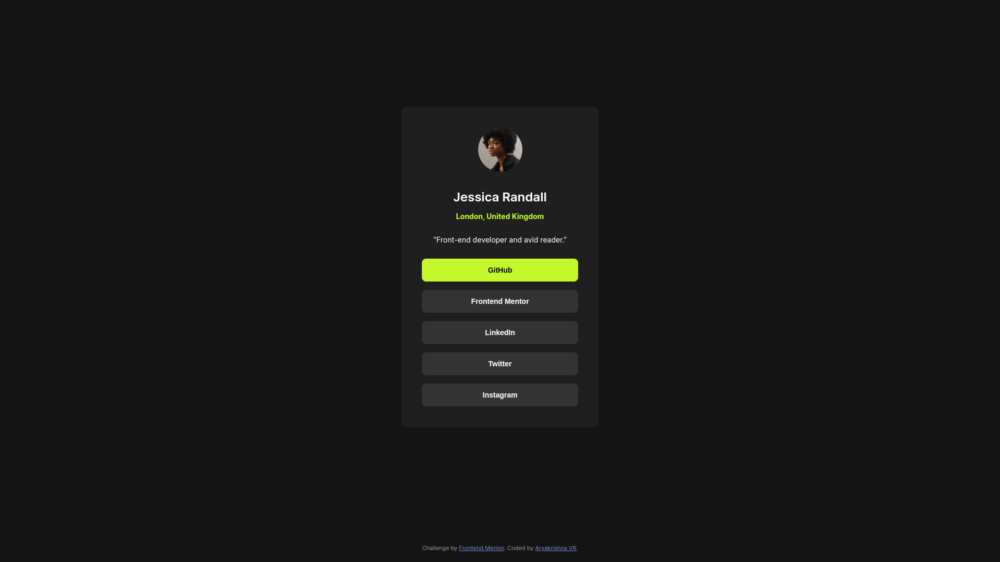

# Frontend Mentor - QR code component solution

This is a solution to the [Social links profile challenge on Frontend Mentor](https://www.frontendmentor.io/challenges/social-links-profile-UG32l9m6dQ). Frontend Mentor challenges help you improve your coding skills by building realistic projects. 

## Table of contents

- [Overview](#overview)
  - [Screenshot](#screenshot)
  - [Links](#links)
- [My process](#my-process)
  - [Built with](#built-with)
  - [What I learned](#what-i-learned)
  - [Useful resources](#useful-resources)

## Overview
This is a solution to the [Social links profile challenge on Frontend Mentor](https://www.frontendmentor.io/challenges/social-links-profile-UG32l9m6dQ).

### Screenshot

### Links
- Solution URL: [https://github.com/aryakrishnaksh2021/challenge-social_link_profile](https://github.com/aryakrishnaksh2021/challenge-social_link_profile)
- Live Site URL: [https://663a68a5917836343e9d04b6--cheery-donut-4a5e9a.netlify.app/](https://663a68a5917836343e9d04b6--cheery-donut-4a5e9a.netlify.app/)

## My process
I began by building the layout of the design using HTML elements. Then, I added style classes to each element. After that, I incorporated media queries for responsive design. Finally, I conducted a Lighthouse audit for performance and accessibility, making adjustments according to best practices.

### Built with
- Semantic HTML5 markup
- CSS custom properties
- Flexbox
- CSS Grid
- Mobile-first workflow

### What I learned
I learned more about the flex properties and gap  property in CSS, as well as how to use them effectively for layout. I also practiced using media query.

### Useful resources
- [https://www.w3schools.com/](https://www.w3schools.com/) - This helped me for understanding CSS in a better way.
